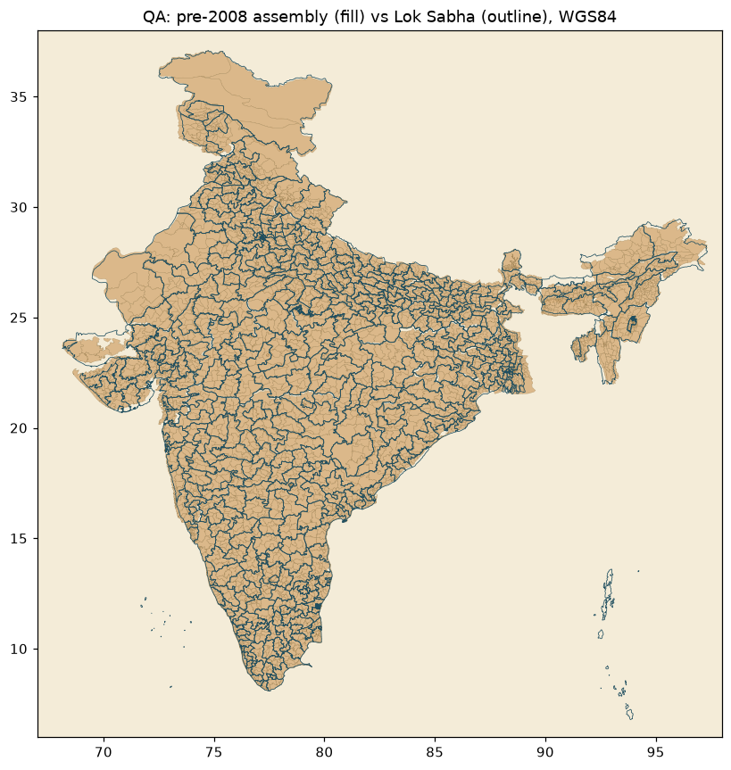

# India pre-2008 constituency maps

Shapefiles for India's **pre-delimitation** electoral constituencies - the boundaries
used before the 2008 delimitation took effect. Two layers:

- **Assembly (Vidhan Sabha) constituencies** - 4,109 ACs across 30 states/UTs
- **Parliamentary (Lok Sabha) constituencies** - 543 PCs across 35 states/UTs

These are the boundaries in force for elections up to and including the pre-2008 cycle
(broadly the 1976 delimitation order). Delimitation redrew almost every boundary from
2008 onward, so if you're mapping old election results (2004 Lok Sabha, pre-2008 state
assemblies) you need *these*, not the current constituencies.



## Layout

```
assembly/
  S01_AC.shp ... S28_AC.shp, U05_AC.shp, U07_AC.shp   # 30 per-state files
  india_assembly.shp                                   # national merge
parliamentary/
  S01_PC.shp ... U07_PC.shp                            # 35 per-state files
  india_parliamentary.shp                              # national merge
manifest.csv                                           # per-state feature counts
scripts/standardise.py                                 # the build script (reproducible)
```

Each shapefile ships with `.shp/.shx/.dbf/.prj`. CRS is **WGS84 (EPSG:4326)**.

State codes are the standard ECI codes (`S01` = Andhra Pradesh, `S24` = Uttar Pradesh,
`U05` = Delhi, and so on).

## Attribute schema

**Assembly** (`*_AC`, `india_assembly`)

| field | type | description |
|-------|------|-------------|
| `ST_CODE` | string | ECI state code (e.g. `S10`) |
| `ST_NAME` | string | State name |
| `AC_NO`   | int    | Assembly constituency number |
| `AC_NAME` | string | Assembly constituency name |
| `AC_TYPE` | string | `GEN` / `SC` / `ST` |
| `PC_NO`   | int    | Parent Lok Sabha constituency number (null for S28) |

**Parliamentary** (`*_PC`, `india_parliamentary`)

| field | type | description |
|-------|------|-------------|
| `ST_CODE` | string | ECI state code |
| `ST_NAME` | string | State name |
| `PC_NO`   | int    | Lok Sabha constituency number |
| `PC_NAME` | string | Lok Sabha constituency name |
| `PC_TYPE` | string | `GEN` / `SC` / `ST` |

State/constituency names are kept as they were in the source, so you'll see the
period-accurate names - **Orissa** (not Odisha), **Uttaranchal** (not Uttarakhand),
**Pondicherry** (not Puducherry). That's deliberate: this is a pre-2008 dataset.

## Coordinate system - read this

The **parliamentary** set was already in clean WGS84 lon/lat and is untouched.

The **assembly** set came with no `.prj` and was in an unknown projected coordinate
system - every state crammed into a small local grid, and Uttaranchal (S28) was
offset entirely. To get it into WGS84, each assembly state was aligned to the same
state's parliamentary (WGS84) bounding box by an axis-aligned affine transform. This
also fixed the misregistered S28 for free.

So the assembly georeferencing is **approximate**. It's good to roughly state level -
plenty accurate for choropleths, overlays, and visualising old results - but it is
**not survey-grade** and shouldn't be used where you need precise boundary geometry.
Sub-state offsets of a few km are visible in places (the northwest especially). The
parliamentary layer does not have this caveat.

The Andaman & Nicobar and Lakshadweep island UTs appear in the parliamentary layer
but not the assembly layer (the source assembly set only had Delhi and Pondicherry
among the UTs).

## Provenance

Derived from a pre-2008 constituency shapefile set (state-wise `AC`/`PC` files,
built ~2004-05). Standardised here: unified field names, consistent title-cased
names, WGS84 CRS with `.prj`, garbled legacy Hindi-name and ambiguous party columns
dropped, and a national merge per layer. See `scripts/standardise.py` for exactly
what was done - the whole thing is reproducible from the source with one script.

## Rebuilding

```bash
python3 -m pip install pyshp   # pure-Python, no GDAL needed
python3 scripts/standardise.py
```

## License

Boundary geometry is derived from third-party sources; treat as reference data.
The standardisation code and documentation here are MIT.
